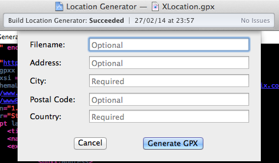
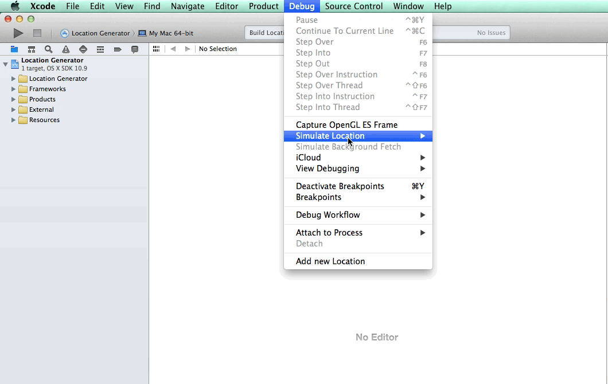
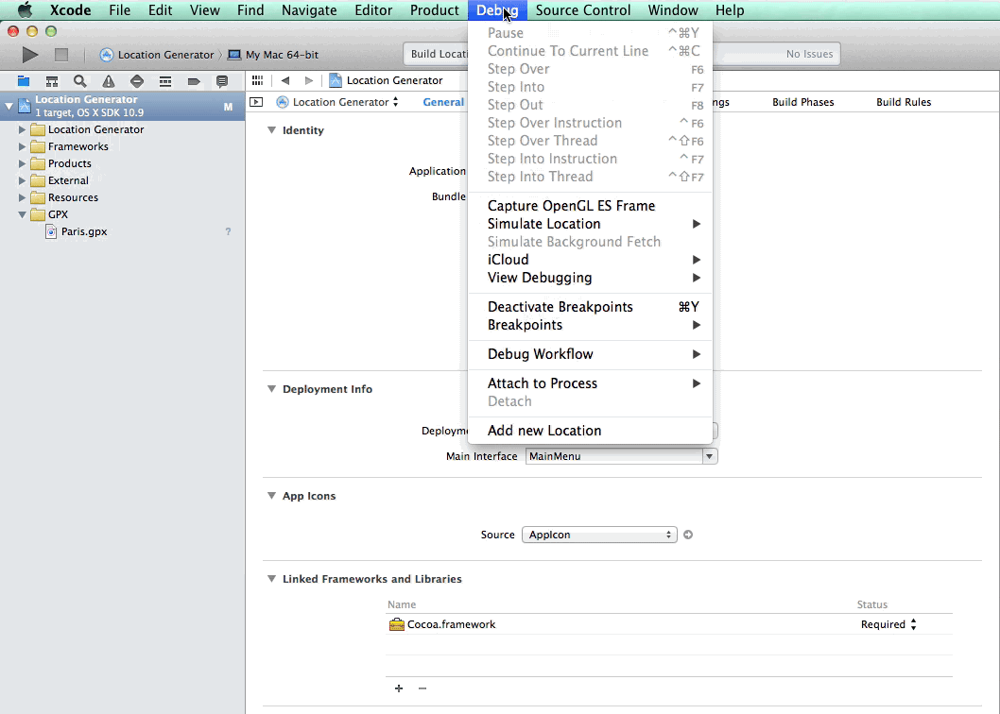
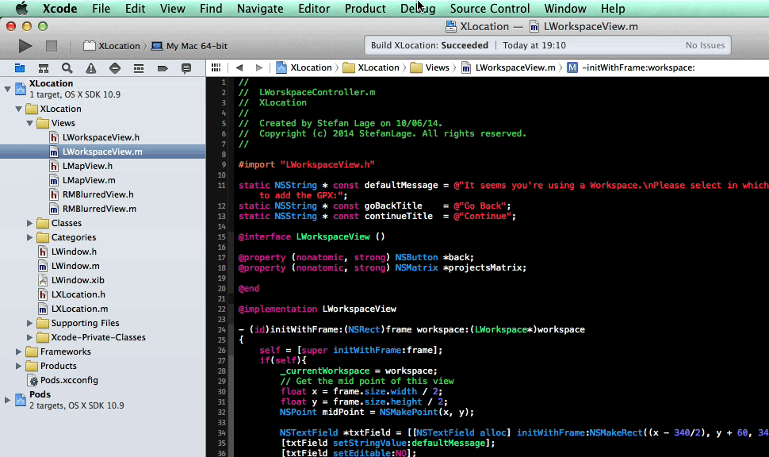

# XLocation

**XLocation** is an open source **XCode** plugin.
<br />
It lets you add a new location from an address known to your current xcode project. **NEW**, now it works in a **Workspace** too.
<br />



##Features

The process is very easy, you just need to enter an address (at least a city and its country), then the plug-in while get the coordinates corresponding to this address and generate the GPX file.

###Using a Map

You get a location from the map view.
<br />
Just need to do a `right click` on the map everywhere you want, then the plugin will get the corresponding address.



###Using your `Own` address

You can create a new GPX file informing the following fields:

```` objective-c
@Required
````

- City
- Country

```` objective-c
@Optional
````

- Address 	(Default value: `Downtown`)
- Zip Code
- The filename



##Workspace

If you are using a workspace with severals projects, you will have to select in which project you would like to add the GPX file.




##Install

###Via Alcatraz

XLocation plugin is available through the [Alcatraz](http://alcatraz.io/).

###From Source

Download the project and build it, then relaunch Xcode.
<br />
A new item named `Add new Location` should appear in the menu item `Debug`.
<br />
XLocation will be installed in `~/Library/Application Support/Developer/Shared/Xcode/Plug-ins` automatically.

If you want to uninstall XLocation, remove XLocation in Plug-ins directory.

##Dependency

[`XcodeEditor`](https://github.com/jasperblues/XcodeEditor) to manipulate Xcode project files.


##License

	Copyright (c) 2014 stefanlage

	Permission is hereby granted, free of charge, to any person obtaining
	a copy of this software and associated documentation files (the
	"Software"), to deal in the Software without restriction, including
	without limitation the rights to use, copy, modify, merge, publish,
	distribute, sublicense, and/or sell copies of the Software, and to
	permit persons to whom the Software is furnished to do so, subject to
	the following conditions:
		
	The above copyright notice and this permission notice shall be
	included in all copies or substantial portions of the Software.

	THE SOFTWARE IS PROVIDED "AS IS", WITHOUT WARRANTY OF ANY KIND,
	EXPRESS OR IMPLIED, INCLUDING BUT NOT LIMITED TO THE WARRANTIES OF
	MERCHANTABILITY, FITNESS FOR A PARTICULAR PURPOSE AND
	NONINFRINGEMENT. IN NO EVENT SHALL THE AUTHORS OR COPYRIGHT HOLDERS BE
	LIABLE FOR ANY CLAIM, DAMAGES OR OTHER LIABILITY, WHETHER IN AN ACTION
	OF CONTRACT, TORT OR OTHERWISE, ARISING FROM, OUT OF OR IN CONNECTION
	WITH THE SOFTWARE OR THE USE OR OTHER DEALINGS IN THE SOFTWARE.