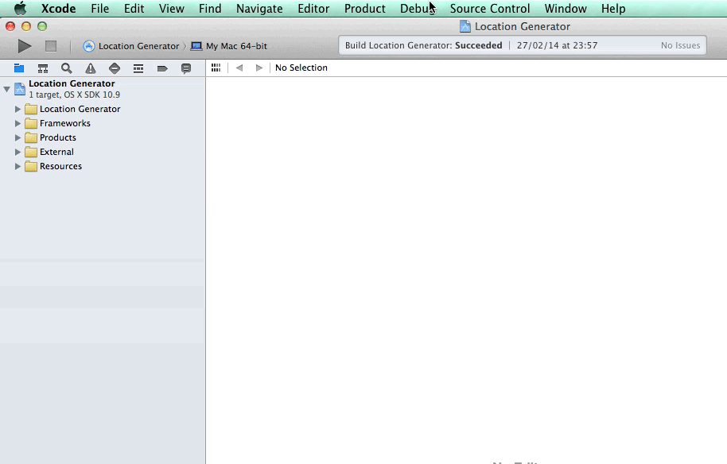

# XLocation

**XLocation** is an open source **XCode** plugin.
<br />
It lets you add a new location from an address known to your current xcode project.
<br />



##Features

The process is very easy, you just need to enter an address (at least a city and its country), then the plug-in while get the coordinates corresponding to this address and generate the GPX file.

You can create a new GPX file, you need to inform the following fields:

```` objective-c
@Required
````

- City
- Country

```` objective-c
@Optional
````

- Address 	(Default value: `Downtown`)
- Zip Code
- The filename


##Installation

Download the project and build it, then relaunch Xcode.
<br />
XLocation will be installed in `~/Library/Application Support/Developer/Shared/Xcode/Plug-ins` automatically.

If you want to uninstall XLocation, remove XLocation in Plug-ins directory.